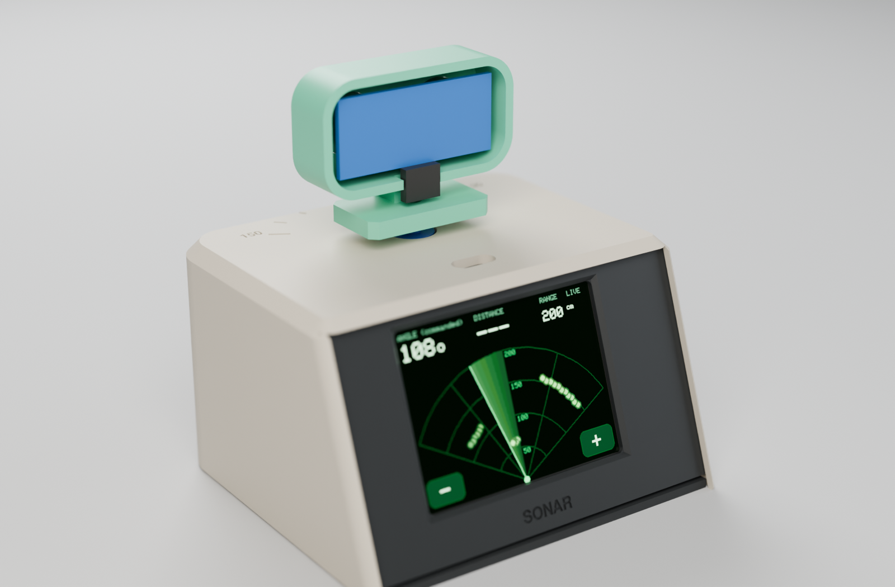
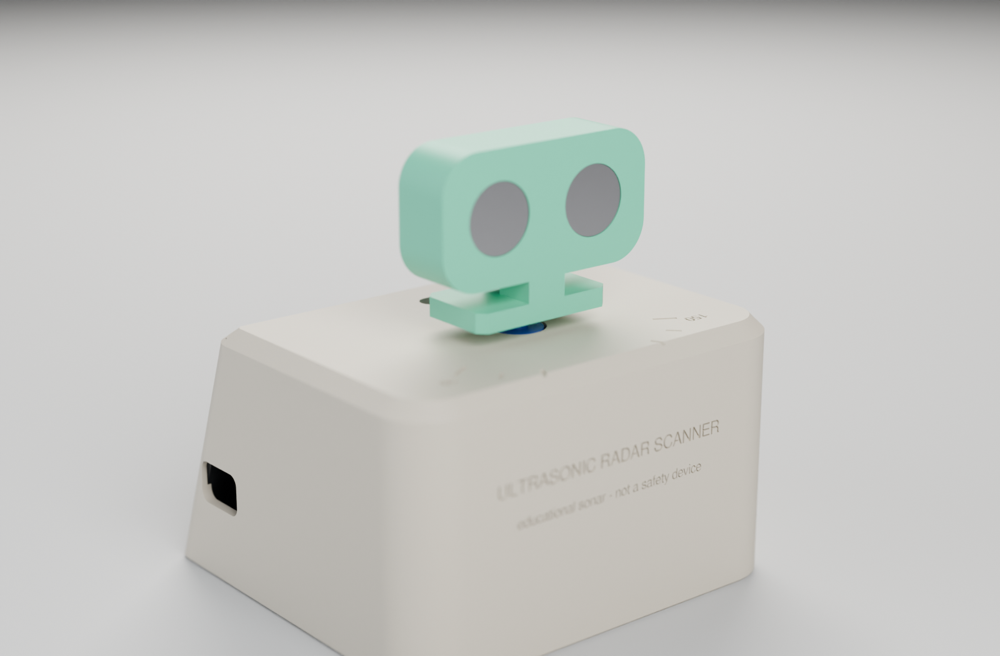
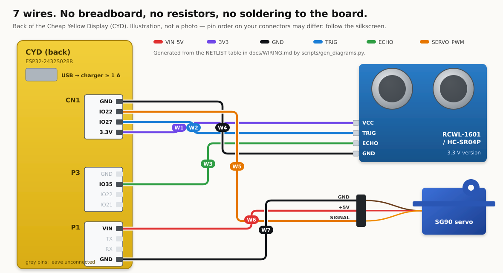

# Ultrasonic Radar Scanner

**A tiny desk console that sweeps an ultrasonic "two-eye" head on a servo and draws what it hears as a green radar-style picture on a 2.8" touch screen.**
Three modules, seven wires, four printed parts, one USB cable.

[](https://github.com/Normansrule/ultrasonic-radar-scanner/actions/workflows/ci.yml)
[](https://normansrule.github.io/ultrasonic-radar-scanner/)
[](https://github.com/Normansrule/ultrasonic-radar-scanner/releases/latest)
[](LICENSE)

<table>
<tr>
<td width="62%"></td>
<td width="38%"><br><br></td>
</tr>
<tr>
<td><sub>Render of the CadQuery model (Blender Cycles) — not a photo.</sub></td>
<td><sub>The firmware's drawing code on <b>synthetic</b> targets; the scan side.</sub></td>
</tr>
</table>

> [!IMPORTANT]
> **Educational sonar with a radar-*style* display. Not radio-frequency radar, and not a safety or obstacle-avoidance device.**
> It sweeps about 120°, and the angle shown is the *commanded* servo position. The CAD, firmware and apps pass automated checks,
> but **no V6 unit has been printed, wired or powered yet.** [`docs/VALIDATION.md`](docs/VALIDATION.md) tracks what is proven.

## The whole kit


| | Part | Est. US$ |
|---|---|---|
| 🖥️ | **ESP32-2432S028R "Cheap Yellow Display"** — ESP32, 2.8" 320 × 240 touch screen, RGB LED, USB | 12–20 |
| 🔊 | **RCWL-1601 or HC-SR04P** ultrasonic sensor (3.3 V version — no resistors needed) | 2–4 |
| ⚙️ | **SG90** micro servo, positional, with horn and its 2 screws | 2–3 |
| 🔌 | 3 × JST 1.25 mm 4-pin → Dupont cables, 3 male-male pins | 1–3 |
| 🖨️ | 4 printed parts, ≈ 120 g PLA, no supports | — |

Plus a USB cable and a ≥ 1 A charger or power bank. **About US$18–30 in total** — rough single-unit
estimates, not quotes. Details and what to check before buying: [`docs/BOM.md`](docs/BOM.md).

## Wire it — 7 wires



| Wire | From (CYD) | To |
|---|---|---|
| W1 | CN1 3.3V | sensor VCC |
| W2 | CN1 IO27 | sensor TRIG |
| W3 | P3 IO35 | sensor ECHO |
| W4 | CN1 GND | sensor GND |
| W5 | CN1 IO22 | servo signal (orange) |
| W6 | P1 VIN | servo + (red) — measure ≈ 5 V first |
| W7 | P1 GND | servo − (brown) |

Pin by pin, connector pinouts, power notes and the 5 V HC-SR04 fallback: [`docs/WIRING.md`](docs/WIRING.md).

## Build it


1. **Print the fit coupon** — [`cad/3mf/plate_S1_fit_coupon.3mf`](cad/3mf/) — and pick peg, hole and screw sizes ([Printing](docs/PRINTING.md)).
2. **Bench test:** wire the 7 wires on the table and flash — <a id="flash"></a>[**Flash page**](https://normansrule.github.io/ultrasonic-radar-scanner/flash.html) in Chrome/Edge, or `arduino-cli compile --upload --profile esp32-core3 -p <port> firmware/Radar_V6`.
3. **Print** [`cad/3mf/radar_a1mini_multiplate.3mf`](cad/3mf/) — plate P1 (shell) and P2 (bezel, base, head).
4. **Assemble** in about 30 minutes ([Assembly](docs/ASSEMBLY.md)) — press fits and the servo's own two screws.
5. **Run and record** the tests in the [build packet](manufacturing/build_packet.pdf).

<table>
<tr>
<td width="50%"></td>
<td width="50%"></td>
</tr>
<tr><td><sub>Shell · bezel (the CYD presses on) · base · head.</sub></td><td><sub>Section: CYD on the bezel, servo under the roof, sensor in the head.</sub></td></tr>
</table>

## Everything you need to make one

| | |
|---|---|
| 🧊 **3D files** | [`cad/3mf`](cad/3mf/) plates · [`cad/stl`](cad/stl/) · [`cad/step`](cad/step/) · source [`cad/build_radar.py`](cad/build_radar.py) (every dimension a named variable) |
| 🧾 **Parts list** | [`docs/BOM.md`](docs/BOM.md) · [`manufacturing/bom.csv`](manufacturing/bom.csv) |
| 🔌 **Circuit** | [`docs/WIRING.md`](docs/WIRING.md) · [`wiring_pins.csv`](manufacturing/wiring_pins.csv) · [`wire_list.csv`](manufacturing/wire_list.csv) |
| 📄 **Build packet** | [`manufacturing/build_packet.pdf`](manufacturing/build_packet.pdf) — print it, tick every step |
| ✅ **Requirements** | [`docs/REQUIREMENTS.md`](docs/REQUIREMENTS.md) — 33, each traced to a check or test |
| 💾 **Firmware** | [`firmware/Radar_V6`](firmware/Radar_V6/) — Arduino, pinned ESP32 core + libraries, compiles with 0 warnings |
| 🌐 **Apps** | [web app](https://normansrule.github.io/ultrasonic-radar-scanner/) (guide, simulator, live console, flasher) · desktop app on [Releases](https://github.com/Normansrule/ultrasonic-radar-scanner/releases/latest) |
| 📦 **Manufacturing kit** | one ZIP per [release](https://github.com/Normansrule/ultrasonic-radar-scanner/releases/latest): build packet, CSVs, 3MF/STL/STEP, diagrams, firmware |

## How it works

| | Equation | With the defaults |
|---|---|---|
| Distance | $d = v t / 2$, $v ≈ 331.3 + 0.606\,T$ | 5 823 µs at 20 °C → 100 cm |
| Servo | 50 Hz frame, 1.0–2.0 ms pulse, 16-bit duty | 90° → 1500 µs → 4915 |
| Sweep | $T = N_{moves}(t_{settle} + t_{overhead})$ | 40 × ~115 ms ≈ 4.6 s one way (estimate) |

Intuition, worked examples and plots: [`docs/EQUATIONS.md`](docs/EQUATIONS.md). Every number is re-checked by a test.

## Use it

* **On the device:** tap **−** / **+** to change the range (50–400 cm), tap the radar to pause. The LED turns red under 30 cm.
* **Live console:** plug the scanner into a computer — the same USB cable carries the readings — and open the
  [live console](https://normansrule.github.io/ultrasonic-radar-scanner/live.html) or the desktop app. Record and replay sessions ([`docs/LIVE_LINK.md`](docs/LIVE_LINK.md)).

## Publish, rebuild, contribute

* **Put it on GitHub from a fresh Ubuntu terminal:** one paste — [`docs/PUBLISH.md`](docs/PUBLISH.md).
* **Regenerate everything:** `python scripts/render_cad.py`, `render_previews.py`, `render_beauty.py` (Blender `bpy`), `sim_display.py`,
  `gen_diagrams.py`, `export_mfg.py`, `make_build_packet.py`, `gen_traceability.py`, `build_site.py`, then `python -m pytest tests`.
* **Built one?** Fill in the build packet's test sheet and send the results as a pull request to [`docs/VALIDATION.md`](docs/VALIDATION.md).

<details>
<summary><b>Repository layout</b></summary>

```
cad/build_radar.py           CadQuery source (model of record)
cad/3mf  cad/stl  cad/step    generated print files and editable CAD (never edit by hand)
firmware/Radar_V6/            Radar_V6.ino + sketch.yaml (pinned ESP32 core and libraries)
manufacturing/                bom.csv, printed_parts.csv, wiring_pins.csv, wire_list.csv, build_packet.pdf
docs/                         REQUIREMENTS, BOM, WIRING, PRINTING, ASSEMBLY, EQUATIONS, LIVE_LINK,
                              VALIDATION, SECURITY, PUBLISH, GLOSSARY
hardware/diagrams/            renders, wiring picture, parts kit, plates, GIF (all generated)
site/                         web app (GitHub Pages): landing, live console, flasher, guide
app/                          desktop app (Electron)
scripts/                      every generator, packager and exporter
tests/                        pytest, Node and browser checks
sbom/                         CycloneDX toolchain bill of materials
```
</details>

MIT licence · datasheets and credits in [`CREDITS.md`](CREDITS.md) · supply chain and electrical safety in [`docs/SECURITY.md`](docs/SECURITY.md) · terms in [`docs/GLOSSARY.md`](docs/GLOSSARY.md) · [`CHANGELOG.md`](CHANGELOG.md)
