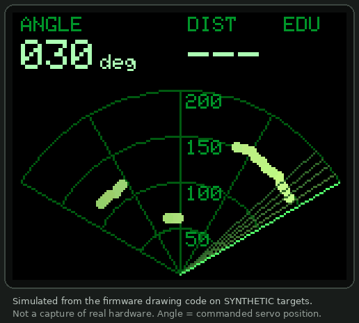
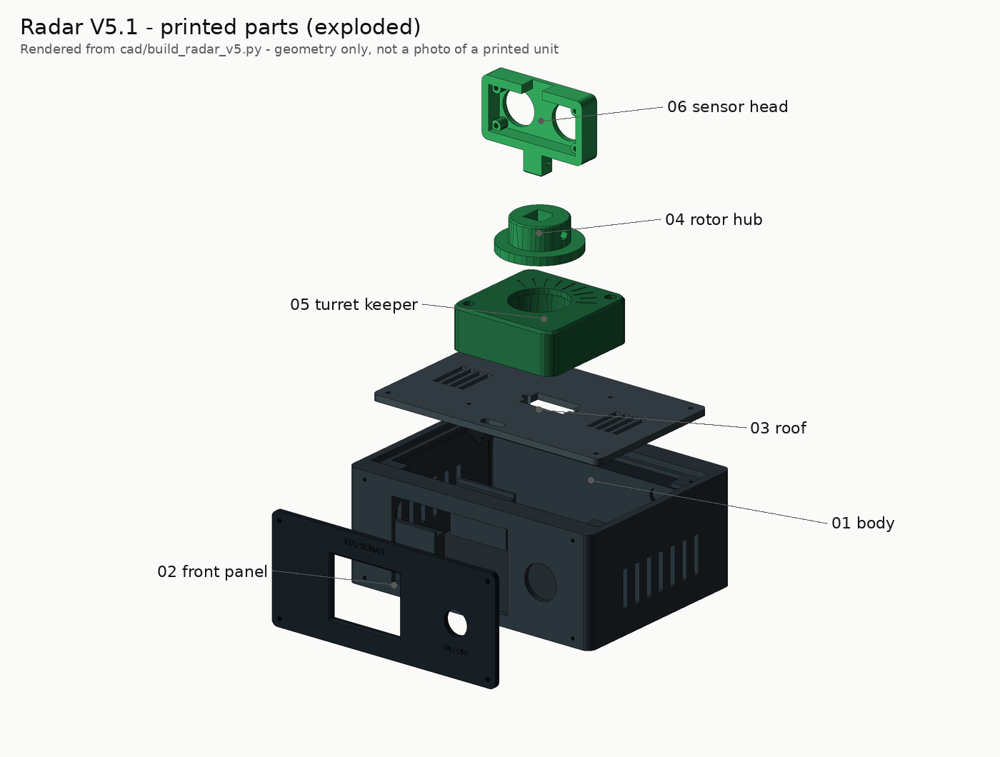
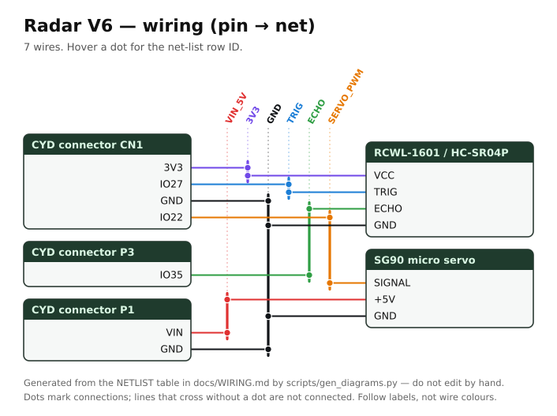
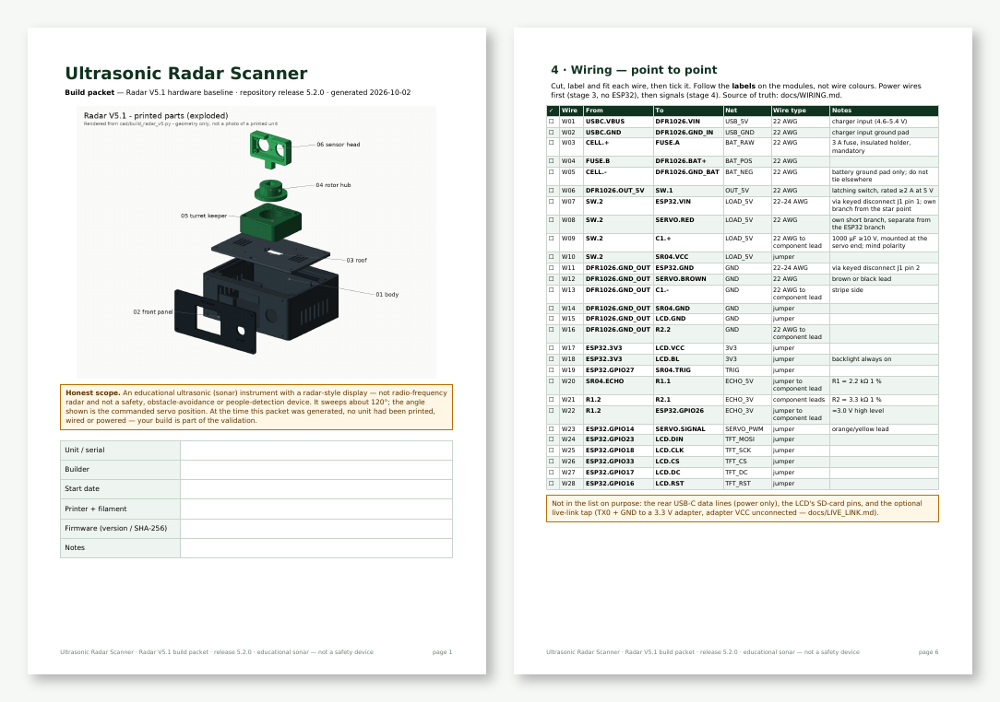
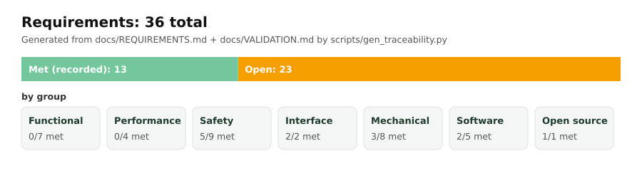
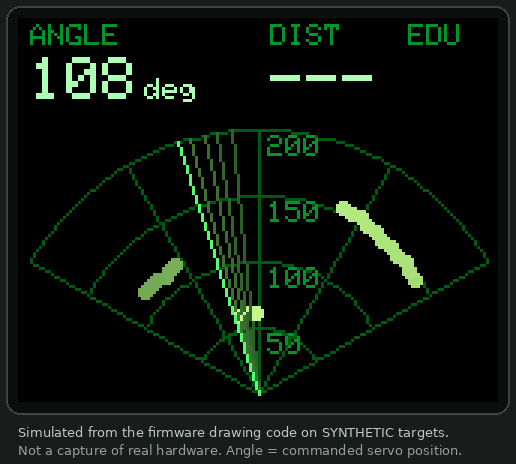
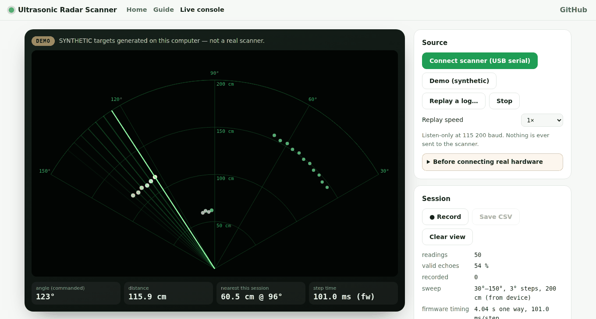
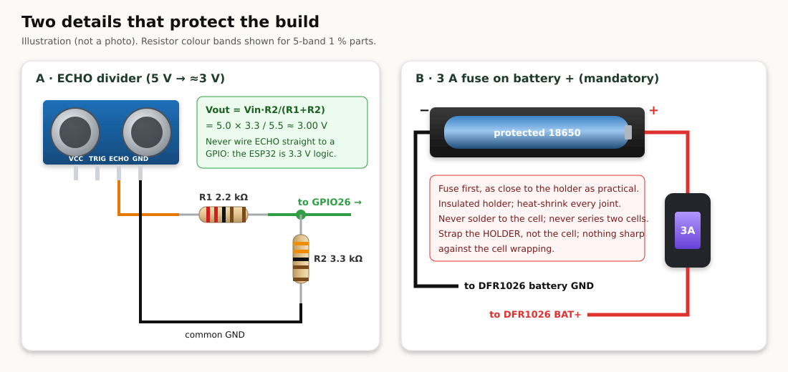

# Ultrasonic Radar Scanner

**A battery-powered desktop instrument that sweeps an ultrasonic sensor on a servo and draws what it hears as a green radar-style picture.**
Open hardware: 3D files, parts list, pin-by-pin wiring, firmware, a printable build packet, and web and desktop apps.

[](https://github.com/Normansrule/ultrasonic-radar-scanner/actions/workflows/ci.yml)
[](https://normansrule.github.io/ultrasonic-radar-scanner/)
[](https://github.com/Normansrule/ultrasonic-radar-scanner/releases/latest)
[](LICENSE)

<table>
<tr>
<td width="50%"></td>
<td width="50%"></td>
</tr>
<tr>
<td><sub>The firmware's drawing code on <b>synthetic</b> targets (simulated, not a photo).</sub></td>
<td><sub>Six printed parts, rendered from the CadQuery source.</sub></td>
</tr>
</table>

> [!IMPORTANT]
> **Educational sonar with a radar-*style* display. Not radio-frequency radar, and not a safety or obstacle-avoidance device.**
> It sweeps about 120°, and the angle shown is the *commanded* servo position. The CAD, firmware and apps pass automated checks,
> but **no unit has been printed, wired or powered yet.** [`docs/VALIDATION.md`](docs/VALIDATION.md) tracks what is proven.

## Everything you need to make one

<table>
<tr>
<td width="25%" align="center"><a href="cad/"></a><br><b><a href="cad/">3D files</a></b><br><sub>3MF plates · STL · STEP · CadQuery source</sub></td>
<td width="25%" align="center"><a href="manufacturing/bom.csv"></a><br><b><a href="docs/BOM.md">Parts list</a></b><br><sub>27 items · <a href="manufacturing/bom.csv">bom.csv</a></sub></td>
<td width="25%" align="center"><a href="docs/WIRING.md"></a><br><b><a href="docs/WIRING.md">Wiring, pin by pin</a></b><br><sub>46 pins · 28 wires · <a href="manufacturing/wire_list.csv">wire_list.csv</a></sub></td>
<td width="25%" align="center"><a href="manufacturing/build_packet.pdf"></a><br><b><a href="manufacturing/build_packet.pdf">Build packet (PDF)</a></b><br><sub>print it · tick every step</sub></td>
</tr>
<tr>
<td align="center"><a href="docs/REQUIREMENTS.md"></a><br><b><a href="docs/REQUIREMENTS.md">Requirements</a></b><br><sub>36 · traced to tests</sub></td>
<td align="center"><a href="firmware/Radar_V5/Radar_V5.ino"></a><br><b><a href="firmware/Radar_V5/">Firmware</a></b><br><sub>Arduino · ESP32 · <a href="https://normansrule.github.io/ultrasonic-radar-scanner/flash.html">flash from the browser</a></sub></td>
<td align="center"><a href="https://normansrule.github.io/ultrasonic-radar-scanner/live.html"></a><br><b><a href="docs/LIVE_LINK.md">Web + desktop app</a></b><br><sub>guide · simulator · live console</sub></td>
<td align="center"><a href="https://github.com/Normansrule/ultrasonic-radar-scanner/releases/latest"></a><br><b><a href="https://github.com/Normansrule/ultrasonic-radar-scanner/releases/latest">Manufacturing kit</a></b><br><sub>one ZIP per release</sub></td>
</tr>
</table>

## Build it in five gated stages


1. **Fit coupon:** print [`plate_S1_fit_coupon.3mf`](cad/3mf/) and tune the hole sizes ([Printing](docs/PRINTING.md)).
2. **Servo fit:** print [`plate_S2_servo_fit_subset.3mf`](cad/3mf/), then fit the servo, hub and keeper ([Assembly](docs/ASSEMBLY.md)).
3. **Bench power:** wire the charger, fuse, cell and switch only (wires W01–W06), and check the voltages.
4. **Flash and bench run:** flash the firmware ([Flash page](https://normansrule.github.io/ultrasonic-radar-scanner/flash.html) or Arduino), wire the signals, and check the sweep.
5. **Full print:** print plates P1 and P2, assemble, and record the tests in the [build packet](manufacturing/build_packet.pdf).

## Safety first

* **The 3 A fuse on the battery positive lead is mandatory.**
* Never connect a bare cell to the ESP32 VIN or the servo. Use a **protected** 18650 and never solder to the cell.
* The HC-SR04 **ECHO** pin is 5 V. It goes to GPIO26 **only** through the 2.2 kΩ / 3.3 kΩ divider.
* **Never** plug the ESP32's own USB in while the battery harness is connected. Unplug the harness to program it.
* Don't charge unattended while you're prototyping.



## What's inside

| | Part | Wired to |
|---|---|---|
| 🧠 | ESP32-WROOM-32 DevKit (30-pin) | the hub of everything |
| 🔊 | HC-SR04 ultrasonic sensor | TRIG → GPIO27 · ECHO → divider → GPIO26 |
| ⚙️ | SG90 positional servo | signal → GPIO14 · power from the switched 5 V rail |
| 🖥️ | 1.8" ST7735S LCD, 160 × 128 | DIN 23 · CLK 18 · CS 33 · DC 17 · RST 16 |
| 🔋 | Protected 18650 → **3 A fuse** → DFR1026 charger/boost → latching switch | USB-C charges it (5 V only) |
| 🖨️ | 6 PLA parts with M2 screws only | Bambu Lab A1 mini plates, no supports |


> [!WARNING]
> **Open power issue:** the DFR1026 charger module may need its on-board button to turn back on after the switch goes OFF → ON. The test for it and two documented fall-backs are in [`docs/WIRING.md`](docs/WIRING.md#open-issue--dfr1026-restart-after-offon-unresolved-must-be-bench-tested).

## How it works

| | Equation | With the defaults |
|---|---|---|
| Distance | $d = v t / 2$, $v ≈ 331.3 + 0.606\,T$ | 5 823 µs at 20 °C → 100 cm |
| ECHO divider | $V_{out} = V_{in} R_2 / (R_1 + R_2)$ | 5.0 V → 3.0 V |
| Servo | 50 Hz frame, 1.0–2.0 ms pulse, 16-bit duty | 90° → 1500 µs → 4915 |
| Sweep | $T = N_{moves}(t_{settle} + t_{overhead})$ | 40 × ~101 ms ≈ 4.0 s (estimate) |

Intuition, worked examples and plots are in [`docs/EQUATIONS.md`](docs/EQUATIONS.md). Every number is re-checked by a test.

## Use it

* **Web app:** [normansrule.github.io/ultrasonic-radar-scanner](https://normansrule.github.io/ultrasonic-radar-scanner/). It has the build guide, simulator, wiring explorer, live console and firmware flasher, and can be installed as an app.
* **Desktop app:** download it from [Releases](https://github.com/Normansrule/ultrasonic-radar-scanner/releases/latest) (Windows, macOS or Linux). It works fully offline.
* **Live console:** watch the real sweep over a two-wire, listen-only serial tap, replay logs and record sessions ([`docs/LIVE_LINK.md`](docs/LIVE_LINK.md)).

## Publish, rebuild, contribute

* **Put it on GitHub from a fresh Ubuntu terminal:** [`docs/PUBLISH.md`](docs/PUBLISH.md). This is one paste, and it also creates the web app and the release.
* **Regenerate everything:** run `python scripts/render_cad.py`, `render_previews.py`, `gen_diagrams.py`, `export_mfg.py`, `make_build_packet.py`, `gen_traceability.py` and `build_site.py`, then `python -m pytest tests`.
* **Built one?** Fill in the build packet's test sheet and send the results as a pull request to [`docs/VALIDATION.md`](docs/VALIDATION.md).

<details>
<summary><b>Repository layout</b></summary>

```
cad/build_radar_v5.py        CadQuery source (model of record); every dimension is a named variable
cad/3mf  cad/stl  cad/step    generated print files and editable CAD (never edit by hand)
firmware/Radar_V5/            Radar_V5.ino + sketch.yaml (pinned ESP32 core and libraries)
manufacturing/                bom.csv, printed_parts.csv, wiring_pins.csv, wire_list.csv, build_packet.pdf
docs/                         REQUIREMENTS, BOM, WIRING, PRINTING, ASSEMBLY, EQUATIONS, LIVE_LINK,
                              VALIDATION, SECURITY, PUBLISH, GLOSSARY
hardware/diagrams/            generated wiring, callouts, renders, plates, GIF
site/                         web app (GitHub Pages): landing, live console, flasher, guide
app/                          desktop app (Electron)
scripts/                      every generator, packager and exporter
tests/                        pytest, Node and browser checks
sbom/                         CycloneDX toolchain bill of materials
```
</details>

MIT licence · datasheets and credits in [`CREDITS.md`](CREDITS.md) · supply chain and electrical safety in [`docs/SECURITY.md`](docs/SECURITY.md) · terms in [`docs/GLOSSARY.md`](docs/GLOSSARY.md)
