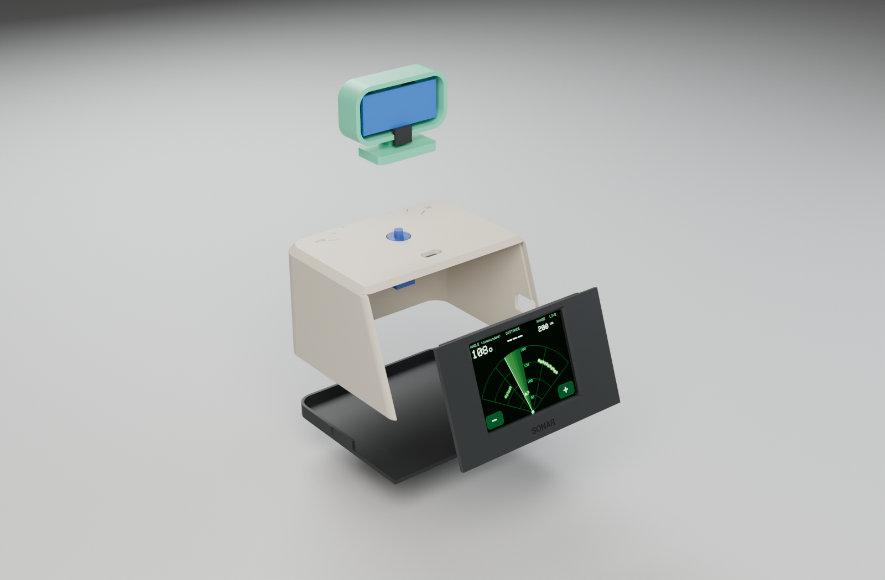
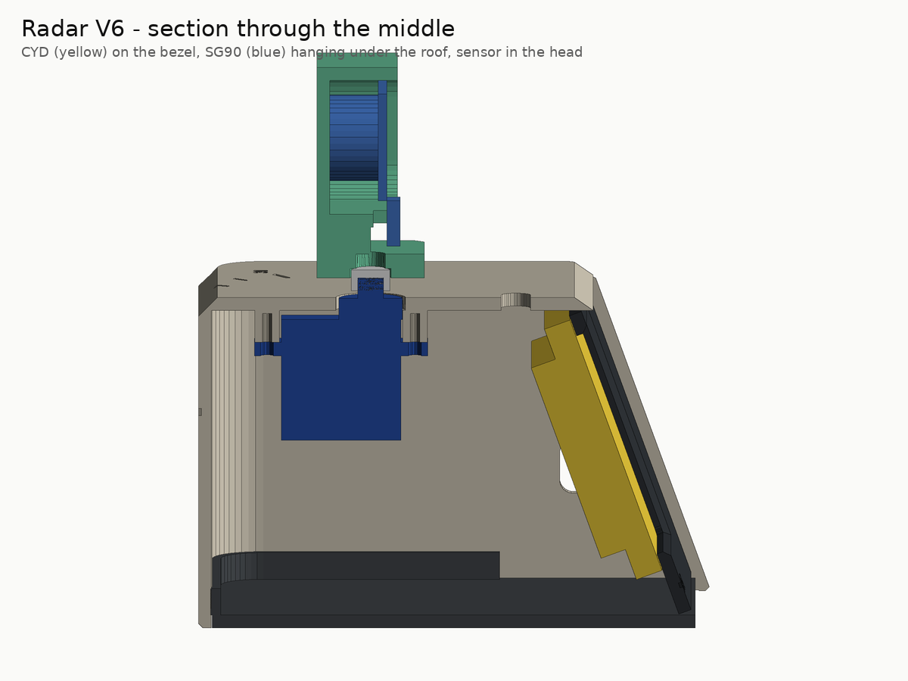

# Assembly — about 30 minutes

Status: **not yet assembled by anyone** — this is the intended procedure. Record what happens in
[`VALIDATION.md`](VALIDATION.md); the [build packet](../manufacturing/build_packet.pdf) has the same
steps with tick boxes.

You need: the four printed parts, the CYD, the sensor, the SG90 (with its horn and two screws), three
JST-to-Dupont cables, three male-male pins, a small Phillips screwdriver and a USB cable.

## 1 · Fit coupon

Print `plate_S1_fit_coupon.3mf` and choose the peg, sensor-hole and screw-pilot sizes
([Printing](PRINTING.md#the-fit-coupon)).

## 2 · Bench test before printing the rest

1. Wire the seven wires on the table ([Wiring](WIRING.md)) — USB unplugged.
2. Before the servo is connected, plug in USB and measure **P1 VIN ≈ 5 V** to GND (T-PWR-1). Unplug.
3. Connect the servo, plug in USB and flash: the **Flash** page in Chrome/Edge, or
   `arduino-cli compile --upload --profile esp32-core3 -p <port> firmware/Radar_V6`.
4. You should see the splash "EDU SONAR … NOT a safety device", then the green fan and the sweep.
   Touch **−** / **+** (bottom corners) to change the range; tap the fan to pause.
5. Point the sensor at a wall at a known distance and compare (T-FW-5).

**Wrong picture?** Open the serial monitor (115 200 baud): the `# board … panel …` line says which
display driver was detected. Then, in `firmware/Radar_V6/Radar_V6.ino`:

| Symptom | Setting |
|---|---|
| garbled or blank | `PANEL = PANEL_ILI9341` or `PANEL_ST7789` instead of `PANEL_AUTO` |
| colours inverted (black is white) | `INVERT_OVERRIDE = 0` or `1` |
| red looks blue | `SWAP_RED_BLUE = true` |
| glitches or stripes | `TFT_SPI_HZ = 27000000` |
| board resets when the servo starts | better charger (≥ 1 A), then the optional capacitor |

## 3 · Print

Plates P1 and P2, no supports ([Printing](PRINTING.md)).

## 4 · Assemble

1. **Servo.** With the shell upside down, hold the SG90 against the two bosses under the roof, output
   shaft up through the turret hole, and fix it with **its own two screws**.
2. **Centre it.** Flash once with `CENTER_ONLY = true`: the servo holds 90°.
3. **Sensor into the head.** Press the two transducer cans into the head's holes from behind
   (pins towards the neck). Plug the four sensor wires on and feed them down through the slot next
   to the turret hole. Leave a loop of about 60 mm so the head can turn ±60° without tugging.
4. **Head onto the servo.** Press the single-arm horn into the slot in the head's foot, then press the
   horn onto the servo spline with the head **facing straight away from the screen**. The small horn
   screw is optional.
5. **Screen.** Press the CYD onto the four pegs on the back of the bezel, screen through the window,
   USB socket towards the shell's side opening.
6. **Bezel in.** Slide the bezel down into the grooves in the shell's front opening.
7. **Cables.** Plug the three cables into CN1, P3 and P1 and check them against the [net list](WIRING.md).
8. **Base.** Press the base into the bottom of the shell; its rim locks the bezel.
9. **Run.** Flash again with `CENTER_ONLY = false`. If the screen sweeps the opposite way to the head,
   set `REVERSE_SERVO = true`.

## 5 · Calibrate and record

Set `CALIBRATE_SERVO = true`: the head steps 30° → 90° → 150° with 4 s holds and prints each pulse
width. Compare with the ticks engraved on the roof and nudge `SERVO_US_AT_0` / `SERVO_US_AT_180` in
small steps. If the servo buzzes or strains at an end, back off. Set it back to `false`, then fill in
the test sheet (T-CAL-1, T-SWP-1, T-PWR-2, T-THM-1).
