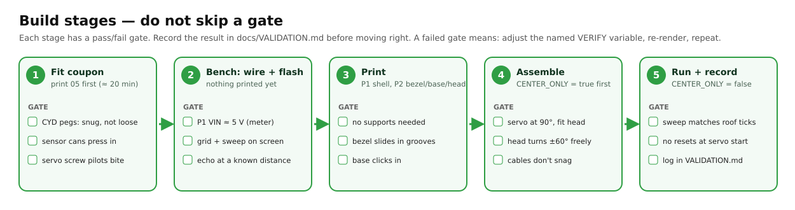
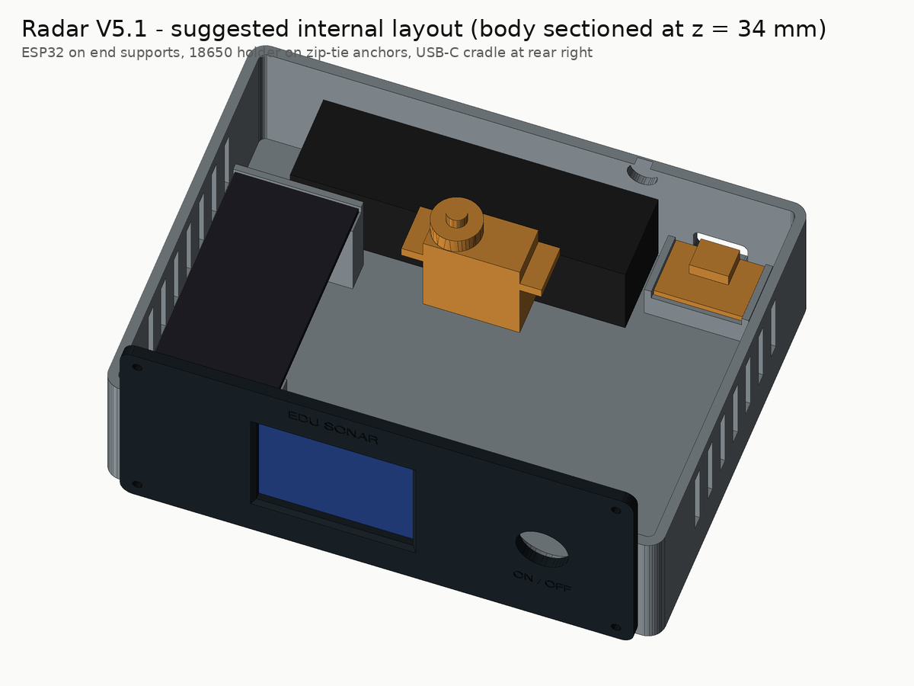
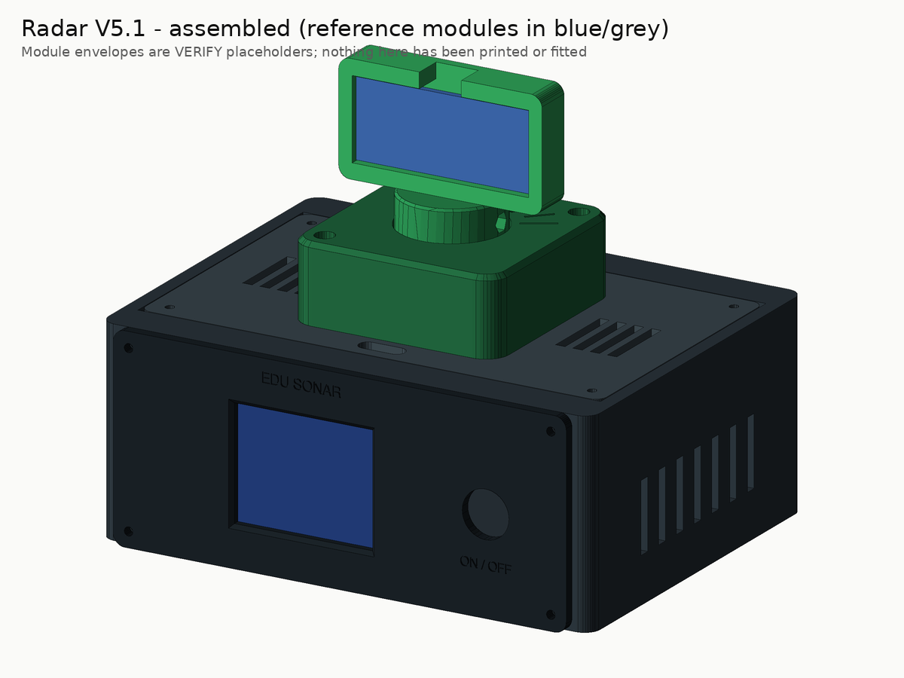

# Assembly

> ⚠️ **Educational instrument, not safety equipment.** It measures with sound, shows a
> radar-*style* picture, and must never be used for obstacle avoidance, people detection or any
> safety decision. The angle on screen is the **commanded** servo position, not a measured one.

Status: this procedure is written from the CAD model and the module datasheets. **It has not yet
been carried out on a real build** — expect to correct it, and record what you find in
[`VALIDATION.md`](VALIDATION.md).

**Print the [build packet](../manufacturing/build_packet.pdf)** — the same steps as tick boxes, with the wire list, coupon
sheet and the physical test sheet.

## Battery and electrical safety (read before stage 3)

* The **3 A fuse on the battery positive lead is mandatory.** Fit it before anything else touches the cell.
* Never connect a bare cell to the ESP32 VIN or to the servo. Only the charger module's 5 V output feeds the scanner.
* Never solder to the cell. Never put two cells in series. Use a **protected** cell.
* Secure the **holder**, not the cell. No screw tips, sharp leads or zip-tie ends may press on the cell wrapping.
* Heat-shrink every power joint. Keep power leads short and use 22 AWG.
* While prototyping, **do not leave it charging unattended**, and charge on a non-flammable surface.
* If the cell, charger or wiring gets hot, smells, swells or hisses: switch off, unplug USB-C, move it somewhere safe.

## Words used on this page

| Term | Meaning |
|---|---|
| Spline | The toothed output shaft of the servo. The factory horn grips it. |
| Horn | The plastic arm that came with the servo. Here it is screwed inside the rotor hub. |
| Axial play | How far the hub can lift before it touches the keeper lip. |
| Harness | All the wires that plug onto the ESP32, including the J1 power plug. |
| VERIFY | A dimension in the CAD file that depends on your exact module — measure it. |

## Stage 1 — fit coupon
Print and test the coupon as described in [`PRINTING.md`](PRINTING.md#stage-1--the-fit-test-coupon-print-this-first).
Adjust any VERIFY variable that needs it, re-run `python scripts/render_cad.py`, and only then continue.

## Stage 2 — servo-fit subset

Parts: 03 roof, 04 rotor hub, 05 turret keeper, the servo with its **factory** double-arm horn,
2× M2×6, 4× M2×8, M2 tap.

1. **Tap the pilots** in the roof (servo flange and keeper bosses) and the hub (two horn holes) with the M2 hand tap. Back the tap out often to clear chips.
2. **Servo into the roof.** From the top, drop the servo body through the rectangular cut-out, cable end first, so the output spline sits in the centre of the turret position. The flange rests on the roof's top face. Fix it with 2× M2×8 through the flange holes.
3. **Horn into the hub.** Pull the horn off the servo. Lay it in the slot on the underside of the hub and fix it with 2× M2×6 from below through the horn's arm holes (`HORN_SCREW_R` = 12 mm is a VERIFY value — use the holes that line up).
4. **Centre the servo before fitting the hub.** Flash the firmware with `CENTER_ONLY = true` (stage 4 explains flashing; for this step you can power the ESP32 and servo from a bench 5 V supply). The servo moves to 90° and holds.
5. **Fit the hub.** Press the hub (with the horn inside) onto the spline so the **pointer groove on the hub faces straight back, toward +Y** (away from where the LCD will be). Drive the servo's own horn screw through the access hole in the middle of the hub's socket.
6. **Fit the keeper** over the hub and screw it to the roof with 2× M2×8 through the counterbored holes (diagonal corners).
7. **Gate checks** (record in `VALIDATION.md`, test T-FIT-3):
   * the hub lifts about 0.2–0.6 mm before touching the keeper lip;
   * by hand, with the servo unpowered, the hub turns smoothly through the whole tick range (30°–150°);
   * the pointer groove lines up with the **90°** tick.
   If it binds, see the shim advice in [`PRINTING.md`](PRINTING.md#stage-2--servo-fit-subset).

Set `CENTER_ONLY` back to **false** before the final upload.

## Stage 3 — bench power (no ESP32 yet)

Parts: USB-C breakout, DFR1026, cell holder + protected cell, 3 A fuse and holder, latching switch,
1000 µF capacitor, multimeter.

Wire **only the power section** of [`WIRING.md`](WIRING.md) (rows P01–P14), following labels, not
colours. Then:

1. With no cell inserted, check with the multimeter that no power net is shorted to GND.
2. Insert the cell. Switch ON. Measure `OUT_5V` → `GND` and `LOAD_5V` → `GND` (expect about 5 V).
3. Switch OFF. `LOAD_5V` should drop to 0 V; `OUT_5V` behaviour is part of the open issue.
4. Plug in USB-C with the switch OFF — the charger should indicate charging. (T-PWR-5)
5. Run the open-issue tests T-PWR-3 (OFF → ON restart after 5 s, 60 s and 10 min) and record the
   results. **If the output does not return by itself, stop and choose Option A or B** in
   [`WIRING.md`](WIRING.md#open-issue--dfr1026-restart-after-offon-unresolved-must-be-bench-tested).

## Stage 4 — flash and bench run

### Install the toolchain once
* **Arduino IDE 2:** File → Preferences → *Additional boards manager URLs*:
  `https://raw.githubusercontent.com/espressif/arduino-esp32/gh-pages/package_esp32_index.json`.
  Boards Manager → install **esp32 by Espressif Systems**. Library Manager → install
  **Adafruit ST7735 and ST7789 Library** (accept its dependencies **Adafruit GFX Library** and
  **Adafruit BusIO**).
* **Or arduino-cli:** `arduino-cli compile --profile esp32-core3 firmware/Radar_V5` installs the exact
  versions pinned in `firmware/Radar_V5/sketch.yaml`.

### Flash
Easiest: the web app's **Flash** page (Chrome/Edge) installs the release firmware with one button. Otherwise follow the [programming procedure](WIRING.md#programming-procedure): switch OFF, unplug the whole
harness from the ESP32 including J1, connect the ESP32's own USB data port, select board
**ESP32 Dev Module**, upload, unplug, re-connect the harness, switch ON.

### Bench-run gates (T-FW-1 … T-FW-5)
1. The splash screen appears ("EDU SONAR … NOT a safety device"), then the green fan grid and the sweep.
   If the picture is shifted, mirrored or has wrong colours, change `TFT_INIT_TAB`, `TFT_ROTATION` or
   `TFT_INVERT` (screen revisions differ).
2. If the sweep line moves the opposite way to the head, set `REVERSE_SERVO = true`.
3. Open the serial monitor at 115 200 baud: each line is `angle_deg,distance_cm` (−1 = no echo). After
   every pass the firmware prints the **measured** step time — record it (T-FW-4).
4. Put a flat object (a book) at 30, 100 and 150 cm on the 90° line (tape measure from the sensor
   face) and record what the screen shows (T-FW-5).
5. **Calibrate travel without hitting the stops** (T-CAL-1): set `CALIBRATE_SERVO = true`; the head
   steps 30° → 90° → 150° with 4 s holds and prints each pulse width. Compare with the keeper ticks and
   nudge `SERVO_US_AT_0` / `SERVO_US_AT_180` in small steps. If you ever hear the servo buzz or strain
   at an end, you have gone too far — back off. Set `CALIBRATE_SERVO = false` afterwards.

## Stage 5 — full print and final assembly

Print P1 and the rest of P2 (sensor head). Then:

1. **Front panel.** Push the 12 mm switch through the panel and tighten its nut from behind (the body
   has a Ø17 mm pocket for the nut). Seat the LCD face-first between the four corner locators on the
   back of the panel; hold it with two strips of double-sided foam tape on the PCB margins (never on
   the glass). Fix the panel to the body with 4× M2×8.
2. **Inside the body** (see the layout picture below):
   * ESP32 on the two end supports, pins **down**, held with foam tape; the header rows hang free
     between the supports. Its USB port faces the side you can reach with the roof off.
   * Cell holder across the two zip-tie anchors at the rear; straps or ties go **around the holder**.
   * USB-C breakout on the rear cradle, receptacle flush with the rear opening; foam tape underneath.
   * DFR1026 on foam tape near the USB-C breakout. Fuse holder in the positive lead, near the cell.
   * 1000 µF capacitor at the servo end of its supply branch.
3. **Sensor head.** Fit the HC-SR04 **header-up** (the header goes through the notch in the top rim),
   transducers through the two windows, 4× M2×12 from the front with nuts on the back.
4. **Head onto the hub.** Push the keyed mast into the hub socket (it only fits one way) and fix it
   with the M2×20 cross-bolt: head on the counterbored side, nut in the hex pocket.
5. **Sensor cable.** Route the four sensor leads from the header, behind the head, down through the
   roof slot. Leave a slack loop long enough for the head to reach both 30° and 150° **without
   tugging** — about 60 mm is a starting point. Nothing may touch the transducers or cross in front of
   them.
6. **Roof.** Lower the roof (with servo, hub, keeper, head) into its pocket and fix with 4× M2×8.
7. Four rubber feet under the body. Check the engraved label on the rear wall is legible.
8. **Final gates** (T-SWP-1, T-PWR-4, T-RUN-1, T-THM-1): powered sweep clears the keeper and does not
   snag the cable; one-hour run without drop-outs; runtime on a full charge; charger and ESP32
   regulator temperatures after 30 minutes.

