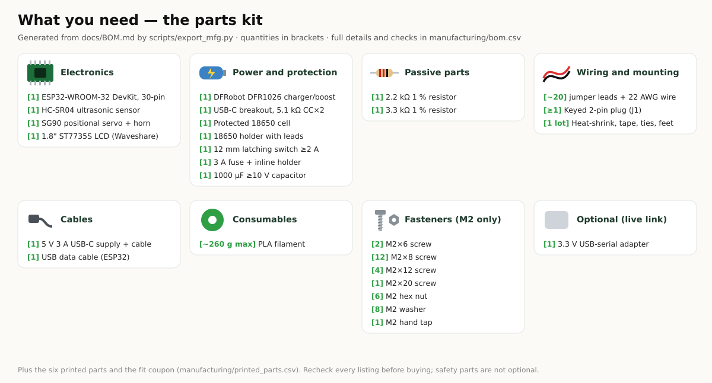

# Bill of materials (BOM) — Radar V6

**Five things to buy, one optional.** No battery, charger, fuse, switch, breadboard, resistors
or screws beyond the two that come with the servo. Spreadsheet: [`manufacturing/bom.csv`](../manufacturing/bom.csv).

Prices are **rough single-unit marketplace estimates (US$, late 2026)** to show the order of
magnitude — not quotes. Check current listings yourself.

## Electronics

| # | Qty | Part | What to check before you buy | Reference candidate | Est. US$ |
|---|---|---|---|---|---|
| E1 | 1 | **ESP32-2432S028R "Cheap Yellow Display" (CYD)** — ESP32 + 2.8" 320×240 touch screen | Exact name `ESP32-2432S028R`. Both the ILI9341 version and the two-USB "CYD2USB" (ST7789) version work — the firmware detects the panel. | [witnessmenow/ESP32-Cheap-Yellow-Display](https://github.com/witnessmenow/ESP32-Cheap-Yellow-Display) | 12–20 |
| E2 | 1 | **Ultrasonic sensor, 3.3 V capable**: RCWL-1601 or HC-SR04P | Listing must say it works from **3 V–5.5 V**. A plain 5 V-only HC-SR04 needs the [fallback divider](WIRING.md#fallback-you-only-have-a-5-v-hc-sr04). | [Adafruit 4007](https://www.adafruit.com/product/4007) (RCWL-1601) | 2–4 |
| E3 | 1 | **SG90 micro servo, positional (180°)**, with horns and its 2 screws | **Not** "360°" or "continuous rotation". The single-arm horn must come in the bag. | TowerPro SG90 | 2–3 |
| E4 | 3 | **JST 1.25 mm 4-pin → Dupont female cable** | Often one is in the CYD box — you need three (CN1, P3, P1). | "1.25 mm 4 pin to Dupont" | 1–2 |
| E5 | 3 | **Male-male Dupont jumper pins** (or 3 short male-male jumpers) | Join the servo plug to the cable. | any | < 1 |
| E6 | 1 (optional) | 470–1000 µF, ≥ 6.3 V electrolytic capacitor | Only if the board resets when the servo moves. | any | < 1 |

You also need a **USB cable** that fits your CYD (micro-USB, or USB-C on CYD2USB boards) with data
lines for flashing, and a **USB charger or power bank rated ≥ 1 A**. Most people already have both.

**Estimated total: about US$18–30** for E1–E5 plus ≈ 120 g of PLA.

## Printed parts

| Part | Plate | Notes |
|---|---|---|
| 05 fit coupon | S1 | print first (≈ 10 cm³) — checks pegs, sensor holes, servo pilots |
| 01 shell | P1 | roof-down, no supports |
| 02 bezel | P2 | face-down |
| 03 base | P2 | flat |
| 04 head | P2 | face-down |

Sizes, volumes and PLA estimates: [`manufacturing/printed_parts.csv`](../manufacturing/printed_parts.csv).
Settings: [`PRINTING.md`](PRINTING.md).

## Fasteners

<!-- FASTENERS:BEGIN -->
| Qty | Item | Used for |
|---|---|---|
| 2 | self-tapping screws that come with the SG90 | servo flange → the two bosses under the roof |
| 1 | small screw that comes with the SG90 horn (optional) | horn → head foot, only if the press fit is loose |
<!-- FASTENERS:END -->

## Tools

Small Phillips screwdriver, side cutters, a multimeter (to check P1 VIN before connecting the
servo), and a 3D printer with a ≥ 105 × 100 mm bed (made for a Bambu Lab A1 mini, 180 × 180 mm).

## What V6 removed (and why it is cheaper)

| V5.1 needed | V6 |
|---|---|
| ESP32 DevKit + separate 1.8" LCD + 8 display wires | one CYD board (screen, touch, ESP32, RGB LED, USB) |
| 18650 cell, holder, charger/boost board, USB-C breakout, fuse, switch, 1000 µF capacitor | one USB cable from a charger or power bank |
| 2.2 kΩ + 3.3 kΩ divider | 3.3 V sensor — no divider |
| M2 screws, nuts, standoffs | press fits + the servo's own screws |
| 20 purchased line items, 28 wires, six printed parts | 5 line items, 7 wires, four printed parts |
