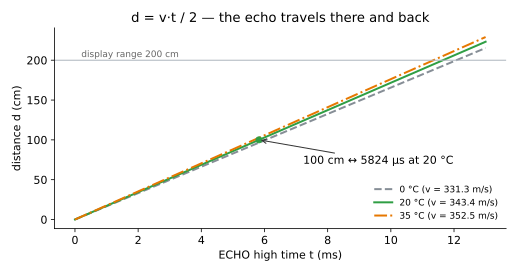
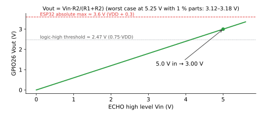
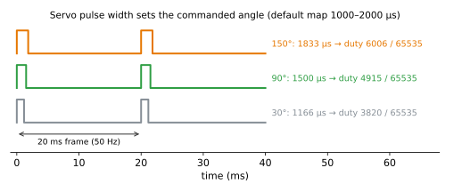
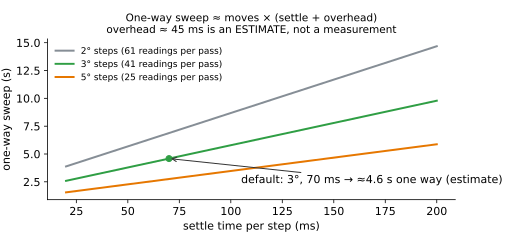

# Equations — how the numbers work

Every equation below follows the same pattern: **plain intuition → equation → symbols and units
→ worked example → picture.** Every number on this page is re-computed by
[`tests/test_equations.py`](../tests/test_equations.py) from one reference implementation,
[`tests/radar_math.py`](../tests/radar_math.py), whose integer maths mirrors the firmware. If a
number here and the test disagree, the test wins.

Run the checks: `python -m pytest tests/test_equations.py -v`

---

## 1. Ultrasonic distance

**Intuition.** The sensor (RCWL-1601 / HC-SR04P) clicks out a short burst of 40 kHz sound and holds its ECHO pin HIGH
until the echo comes back. Sound travels to the object *and back*, so the object is half as far
away as the total path the sound covered.

**Equation.**

$$d = \frac{v \cdot t}{2}, \qquad v \approx 331.3 + 0.606\,T$$

| Symbol | Meaning | Unit |
|---|---|---|
| $d$ | distance from the sensor face to the object | cm (firmware) |
| $v$ | speed of sound in air | m/s (÷10 000 → cm/µs) |
| $t$ | time the ECHO pin stays HIGH | µs |
| $T$ | air temperature | °C |

**Worked example.** At 20 °C, $v = 331.3 + 0.606 \times 20 = 343.42$ m/s $= 0.034342$ cm/µs.
An ECHO pulse of 5 823 µs gives $d = 5823 \times 0.034342 / 2 = 99.99 \approx 100.0$ cm.
Going the other way, 100 cm needs $t = 2 \times 100 / 0.034342 \approx 5 824$ µs.

**Temperature matters.** The same echo converted with the 20 °C constant on a 35 °C day reads
about **2.6 % short** (97.4 cm instead of 100 cm). The firmware has an `AIR_TEMP_C` setting
because there is no temperature sensor in this build.

**Timeout.** The firmware stops waiting after the round trip for 110 % of the display range, plus
1 ms for the burst to start: $2 \times 220 / 0.034342 + 1000 = 13 812$ µs. A timeout shows `---`.

---

## 2. ECHO level — why V6 needs no divider

**Intuition.** The ESP32's pins are 3.3 V parts. The 3.3 V-capable sensor (RCWL-1601 / HC-SR04P) is
powered from the board's 3.3 V, so its ECHO pin can never go above 3.3 V: it connects straight to
IO35. Above the logic-HIGH threshold $0.75\,V_{DD} \approx 2.48$ V, below the absolute maximum
$V_{DD} + 0.3 \approx 3.6$ V.

**Fallback (only with a 5 V-only HC-SR04).** Its ECHO swings to 5 V. Two resistors share that in
proportion to their values:

$$V_{out} = V_{in} \cdot \frac{R_2}{R_1 + R_2}$$

| Symbol | Meaning | Value |
|---|---|---|
| $V_{in}$ | ECHO high level | 5.0 V nominal |
| $R_1$ | top resistor (ECHO → junction) | 2.2 kΩ |
| $R_2$ | bottom resistor (junction → GND) | 3.3 kΩ |
| $V_{out}$ | voltage at IO35 | V |

**Worked example.** $V_{out} = 5.0 \times 3.3 / (2.2 + 3.3) = 3.00$ V, about 0.91 mA through the pair.
With 5.25 V and 1 % resistors it stays between 3.12 V and 3.18 V; at 4.75 V it is still ≥ 2.82 V.

---

## 3. Servo timing and the LEDC duty

**Intuition.** A hobby servo expects one pulse every 20 ms. The *width* of the pulse is the
command: about 1.0 ms means one end, 1.5 ms the middle, 2.0 ms the other end. The ESP32's LED
Control (LEDC) peripheral makes this pulse in hardware by counting up to a "duty" value inside
each 20 ms frame.

**Equations.**

$$T_{frame} = \frac{1}{f} = \frac{1}{50\,\text{Hz}} = 20\,000\ \mu s$$

$$\text{pulse}(\theta) = P_0 + (P_{180} - P_0)\cdot\frac{\theta}{180}$$

$$\text{duty} = \left\lfloor \frac{\text{pulse} \cdot (2^{16} - 1)}{T_{frame}} \right\rfloor$$

| Symbol | Meaning | Default |
|---|---|---|
| $f$ | PWM frequency | 50 Hz |
| $\theta$ | **commanded** angle (not measured) | 30–150° |
| $P_0$, $P_{180}$ | pulse widths mapped to 0° and 180° | 1000 µs, 2000 µs |
| duty | LEDC compare value, 16-bit resolution | counts out of 65 535 |

**Worked example.** 90° → $1000 + 1000 \times 90/180 = 1500$ µs → duty
$\lfloor 1500 \times 65535 / 20000 \rfloor = 4915$ (7.5 % of the frame). 30° → 1166 µs → 3820;
150° → 1833 µs → 6006. One LEDC count is about 0.31 µs, far finer than the servo's ≈10 µs dead band.

**Why 1000–2000 µs is only a starting point.** Many SG90s travel further than 90° for 1.0–2.0 ms,
so the *real* head angle may not equal the *commanded* angle on screen. Use `CALIBRATE_SERVO` and the
tick marks engraved on the roof to adjust `SERVO_US_AT_0` / `SERVO_US_AT_180`, and **never widen the
map so far that the servo buzzes against its internal stops**. A hard clamp (`SERVO_US_GUARD_MIN/MAX`,
900–2100 µs) protects against a bad edit.

---

## 4. Sweep cadence

**Intuition.** Each reading costs a fixed wait for the servo to settle, plus the time to ping and
redraw the screen. The number of readings per pass is fixed by the step size. Multiply.

**Equations.**

$$N_{moves} = \frac{\theta_{max} - \theta_{min}}{\Delta\theta}, \qquad
T_{step} = t_{settle} + t_{overhead}, \qquad
T_{one\,way} = N_{moves} \cdot T_{step}$$

$$f_{refresh} = \frac{1}{T_{step}} \quad\text{(one full frame is drawn per reading)}$$

| Symbol | Meaning | Default |
|---|---|---|
| $\Delta\theta$ | step | 3° |
| $\theta_{min}, \theta_{max}$ | sweep limits (commanded) | 30°, 150° |
| $t_{settle}$ | wait after each move | 70 ms |
| $t_{overhead}$ | ping + draw + SPI frame push | **≈45 ms — ESTIMATE** |

**Worked example.** $N = 120/3 = 40$ moves (41 readings per pass). The screen push alone is
$320 \times 240 \times 16\ \text{bit} / 40\ \text{MHz} \approx 30.7$ ms; add ≈8 ms drawing and ≈6 ms
for a ~1 m echo → $t_{overhead} \approx 45$ ms, $T_{step} \approx 115$ ms, one way ≈ **4.6 s**, a full
round trip ≈ 9.2 s, screen refresh ≈ 8.7 frames/s. Detections live for 10 s, longer than one round
trip, so each dot stays until its angle is revisited.

**This is an estimate, not a measurement.** The firmware prints the measured mean step time and
one-way sweep time over serial after every pass — record the real numbers in
[`VALIDATION.md`](VALIDATION.md) (test T-FW-4). Two sanity checks that *are* derived: a 3° move at
the SG90's ~0.1 s/60° takes ~5 ms (well inside the 70 ms settle), and the ≥70 ms cycle respects the
common HC-SR04-family guidance of ≥60 ms between pings so old echoes die away.

