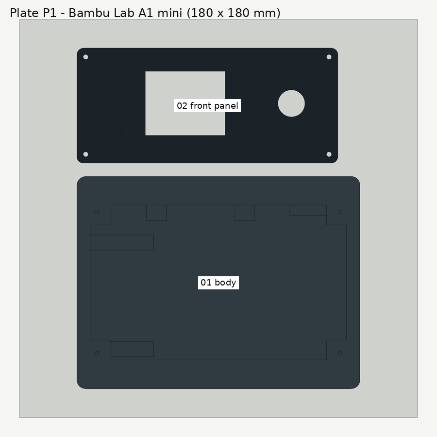
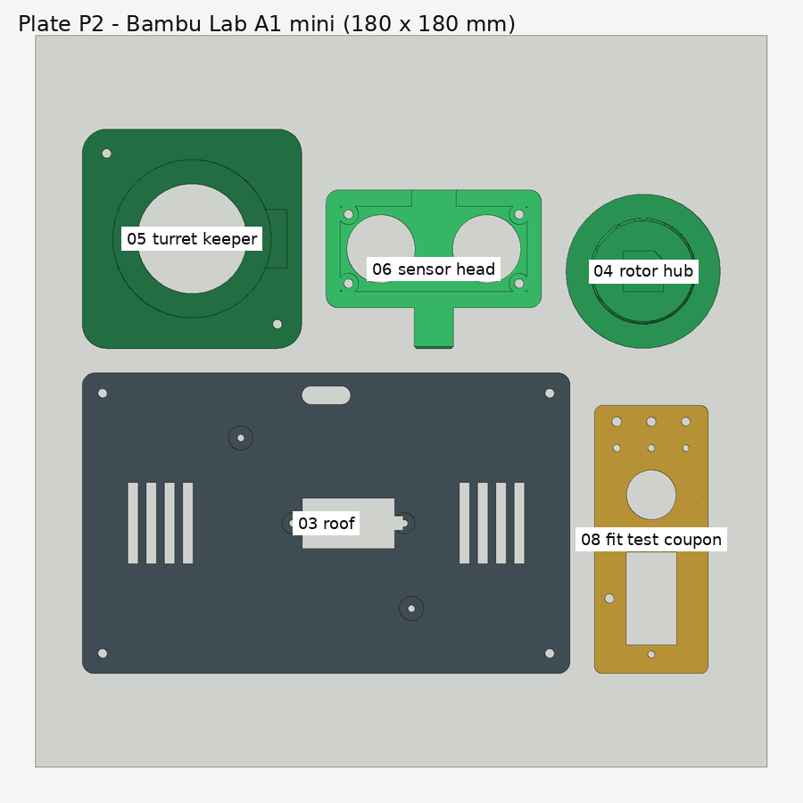
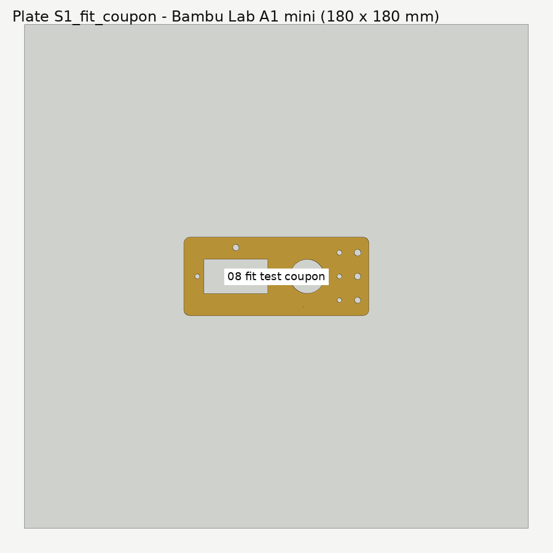

# Printing

Target printer: **Bambu Lab A1 mini** (180 × 180 × 180 mm), 0.4 mm nozzle, PLA. Any printer with a
build plate of at least 176 × 176 mm will take every plate; smaller printers can print the parts
one at a time from `cad/stl/`.

Status: plates, orientations and overhangs are **checked on screen only** (see
[`VALIDATION.md`](VALIDATION.md)). Nothing has been printed yet.

## Which file do I open?

| File | What it is | When to use it |
|---|---|---|
| `cad/3mf/plate_S1_fit_coupon.3mf` | The fit-test coupon alone | **Print first.** Stage 1. |
| `cad/3mf/plate_S2_servo_fit_subset.3mf` | Roof + rotor hub + turret keeper | Stage 2: check the servo, horn and hub before the long print. |
| `cad/3mf/radar_v5_a1mini_multiplate.3mf` | **One file, two plates** (P1, P2) laid out for the A1 mini | Everything, once stages 1–2 pass. |
| `cad/3mf/plate_P1.3mf` | Body + front panel | Fallback if the multi-plate file does not open as two plates. |
| `cad/3mf/plate_P2.3mf` | Roof + hub + keeper + sensor head + coupon | Fallback. |
| `cad/3mf/plate_P3_optional_shim.3mf` | 0.4 mm keeper shim | Only if the hub binds under the keeper (see below). |
| `cad/stl/*.stl` | Each part alone, already in print orientation | Any slicer; re-arrange yourself. |
| `cad/step/*.step` | Each part in its assembled position, plus `assembly_v5.step` | Editing in other CAD tools, checking fit. |

The multi-plate file carries Bambu-style plate metadata written by `scripts/render_cad.py`. It has
**not** been opened in Bambu Studio yet — if it loads as a single plate or complains, use the
`plate_P1` / `plate_P2` fallbacks, which are plain 3D Manufacturing Format (3MF) core files that every
slicer reads. Moving parts are always separate objects; nothing is merged into one solid.




## Slicer settings (starting point)

| Setting | Value | Why |
|---|---|---|
| Layer height | 0.20 mm | 0.4 mm shim prints as exactly two layers |
| Walls | 3 | screw pilots need solid material around them |
| Top / bottom layers | 5 / 4 | |
| Infill | 15–20 % gyroid | |
| Supports | **off** | every overhang is designed at 45° or as a short bridge |
| Brim | 5 mm on the body only, if your plate adhesion is marginal | the body is the tallest, largest footprint |
| Bridging | default on | see the bridges listed below |

## Orientation (already applied in every STL / 3MF)

| Part | On the plate | Note |
|---|---|---|
| 01 body | floor down | the ledge under the roof is a 45° chamfered deck, so it needs no supports |
| 02 front panel | viewer face down | the LCD locators point up; engraved labels print on the first layers |
| 03 roof | top face down | screw bosses point up |
| 04 rotor hub | flange down | the horn nest on the underside is a short bridge |
| 05 turret keeper | top (tick marks) down | the angle ticks are engraved into the first layers |
| 06 sensor head | face down | the keyed mast lies flat on the plate |
| 07 shim | flat | two layers at 0.2 mm |
| 08 fit coupon | flat | |

**Bridges to expect:** the top edge of the LCD window in the body front wall (about 61 mm — it is
hidden behind the front panel and the LCD has 0.4 mm clearance, so a little sag is harmless), the
8 mm ceiling of the LCD relief pocket behind it, the side-vent and USB-C opening tops (≤ 12.5 mm) and
the horn nest in the hub (6.8 mm).

**Knock-out:** the rear wall has a Ø7 mm hole printed with a 0.45 mm outer skin (one line). Leave it
closed unless the power open issue forces Option A in [`WIRING.md`](WIRING.md).

## Stage 1 — the fit-test coupon (print this first)



The coupon is 66 × 28 × 3 mm and tests every printed fit the build depends on. In each column of
three small holes, the hole **nearest the long edge with the engraved "V5 FIT" label is the
smallest**.

| Feature | Sizes | Test | If it fails, change (in `cad/build_radar_v5.py`) |
|---|---|---|---|
| Pilot holes (column nearer the switch hole) | 1.60 / 1.70 / 1.80 mm | Tap M2 by hand. Pick the smallest that taps cleanly without splitting and holds an M2 screw firmly. | `M2_PILOT_D` (default 1.70) |
| Clearance holes (outer column) | 2.15 / 2.25 / 2.35 mm | Pick the smallest an M2 screw drops through without threading. | `M2_CLEAR_D` (default 2.25) |
| Servo cut-out + two flange pilots | body + 0.3 mm/side, 27.5 mm pitch | The servo drops through without force, the flange sits flat, both flange holes line up. | `SERVO_CUTOUT_CLR`, `SERVO_BODY_L/W`, `SERVO_HOLE_PITCH` |
| 12 mm switch hole | 12.2 mm | The switch pushes in and its nut tightens. | `SWITCH_PANEL_D` |
| Hex nut pocket | 4.35 mm across flats | An M2 nut presses in and stays. | `M2_NUT_POCKET_AF` |

Measure your purchased modules with calipers while the coupon prints and compare against every
value marked **VERIFY** at the top of the CAD file (servo, horn, HC-SR04, LCD, USB-C breakout,
ESP32, cell holder). Record what you measured in [`VALIDATION.md`](VALIDATION.md).

## Stage 2 — servo-fit subset

Print `plate_S2_servo_fit_subset.3mf` (roof, hub, keeper). Then follow
[`ASSEMBLY.md` stage 2](ASSEMBLY.md#stage-2--servo-fit-subset). The two numbers that matter:

* the hub's **axial play** under the keeper lip should be about 0.2–0.6 mm (designed: 0.4 mm);
* the hub must turn by hand through the full travel with the keeper screwed down.

If the hub binds, print `plate_P3_optional_shim.3mf` and fit the 0.4 mm shim under the keeper — or,
better, measure the real servo/horn stack and change `HUB_BOTTOM_ABOVE_ROOF`.

## Regenerating the files

Never edit STL/STEP/3MF by hand. Change a variable in `cad/build_radar_v5.py`, then:

```bash
python -m pip install -r requirements.txt
python scripts/render_cad.py        # STL + STEP + 3MF + cad/geometry_report.json
python scripts/render_previews.py   # PNG previews in hardware/diagrams/
python -m pytest tests/             # includes the geometry-report checks
```
