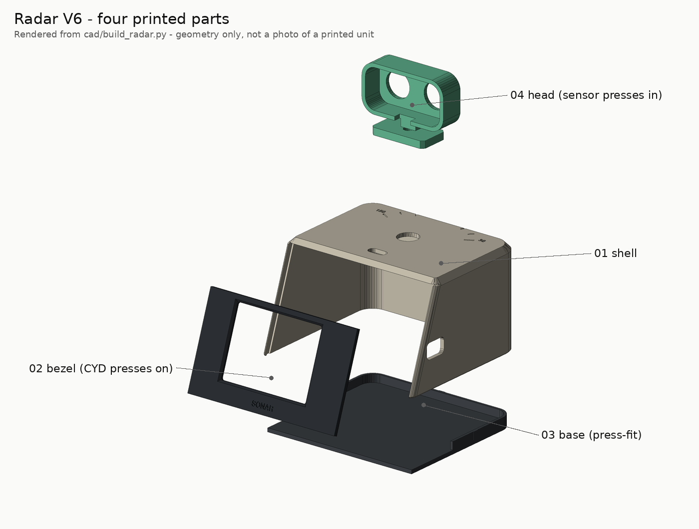

# Printing

Target printer: **Bambu Lab A1 mini** (180 × 180 × 180 mm), 0.4 mm nozzle, PLA. Any printer with a
bed of at least 110 × 105 mm can print every part one at a time from `cad/stl/`.

Status: plates, orientations and overhangs are **checked on screen only** ([`VALIDATION.md`](VALIDATION.md)).
Nothing has been printed yet.

## Which file do I open?

| File | What it is | When |
|---|---|---|
| `cad/3mf/plate_S1_fit_coupon.3mf` | fit coupon (≈ 20 min) | **first** |
| `cad/3mf/radar_a1mini_multiplate.3mf` | **one file, two plates**: P1 shell, P2 bezel + base + head | after the coupon passes |
| `cad/3mf/plate_P1.3mf`, `plate_P2.3mf` | the same plates as plain 3MF | if the multi-plate file opens as one plate |
| `cad/stl/*.stl` | each part alone, already in print orientation | any slicer |
| `cad/step/*.step` | each part in its assembled position, plus `assembly.step` | editing in other CAD tools |

The multi-plate file carries Bambu-style plate metadata written by `scripts/render_cad.py`; it has
**not** been opened in Bambu Studio yet.

| Plate P1 | Plate P2 | Plate S1 |
|---|---|---|
|  |  |  |

## Slicer settings (starting point)

| Setting | Value |
|---|---|
| Layer height | 0.20 mm |
| Walls | 3 (pegs and screw bosses need solid material) |
| Top / bottom layers | 5 / 4 |
| Infill | 15 % gyroid |
| Supports | **off** — every overhang is a 45° chamfer or a short bridge |
| Brim | only if your bed adhesion is marginal (shell) |

**Colours (suggestion):** shell in ivory or white, bezel and base in black or charcoal, head in mint
or any bright colour. One colour works too.

## Orientation (already applied in every STL / 3MF)

| Part | On the plate | Note |
|---|---|---|
| 01 shell | **roof down** | the roof chamfers are 45°; the engraved angle scale prints in the first layers |
| 02 bezel | viewer face down | the four CYD pegs point up |
| 03 base | flat, rim up | three small crush ribs on the rim give the press fit |
| 04 head | face down | neck and foot lie flat |
| 05 coupon | flat | |

## The fit coupon

Print it, then try your real parts in each hole and write the size that works into
`cad/build_radar.py` before printing the rest (`python scripts/render_cad.py` regenerates every file).

| Feature | Sizes | Pick the one where… | Variable |
|---|---|---|---|
| CYD pegs | 2.8 / 2.9 / 3.0 mm | the board's mounting hole presses on and stays | `PEG_D` |
| Sensor-can holes | 16.0 / 16.2 / 16.4 mm | a can presses in and holds | `CAN_HOLE_D` |
| Servo-screw pilots | 1.6 / 1.8 / 2.0 mm | the SG90's own screw bites without splitting | `PILOT_D` |

PLA: ≈ 95 cm³ solid for the four parts (upper bound ≈ 120 g; real use is lower with 15 % infill).
